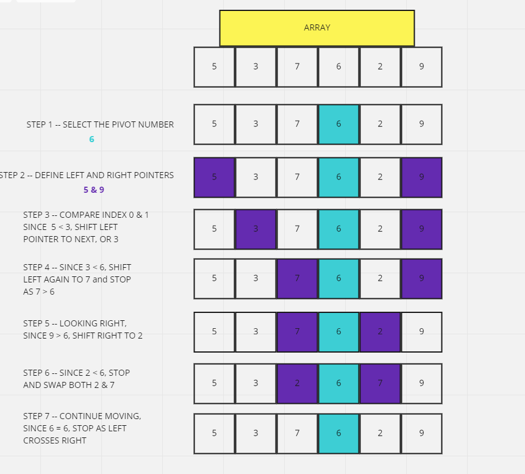

# CODE CHALLENGE 28 | QUICK SORT

### What Is Quick Sort?
An algorithm that follows a Divide and Conquer approach as it divides elements into smaller parts based on some condition and performing the sort operations on those divided smaller parts.

It's one of the most used and popular algorithms in any programming language. 

### VISUAL AND EXPLINATION

In JavaScript, using Default sort() uses insertion sort by V8 Engine of Chrome and Merge sort by Mozilla Firefox and Safari. When working to sort a large number of elements, deafault sort() will not work, thus the need for Quick Sort for a large dataset

Quick sort follows Divide and Conquer algorithm. It is dividing elements in to smaller parts based on some condition and performing the sort operations on those divided smaller parts. Hence, it works well for large datasets.

A general breakdown and high level overhead of Quick Sort:
- First select an element which is to be called as pivot element.
- Next, compare all array elements with the selected pivot element and arrange them in such a way that, elements less than the pivot element are to it's left and greater than pivot is to it's right.
- Finally, perform the same operations on left and right side elements to the pivot element.



One key feature of using Quick Sort is to determin the pivot element from within the array. For the above example, 6 is chosen for this, but as a rule of thumb, it is always advisable to pick the middle element (length of the array divided by 2) as the pivot element.

We also need to create a function to swap elements and to partion the array:

```
function swap(items, leftIndex, rightIndex){
    var temp = items[leftIndex];
    items[leftIndex] = items[rightIndex];
    items[rightIndex] = temp;
}
```

``` 
function partition(items, left, right) {
    var pivot   = items[Math.floor((right + left) / 2)],
        i       = left,
        j       = right;
    while (i <= j) {
        while (items[i] < pivot) {
            i++;
        }
        while (items[j] > pivot) {
            j--;
        }
        if (i <= j) {
            swap(items, i, j);
            i++;
            j--;
        }
    }
    return i;
}
```

Then comes the actual function of quick sort itself:

```
function quickSort(items, left, right) {
    var index;
    if (items.length > 1) {
        index = partition(items, left, right);
        if (left < index - 1) {
            quickSort(items, left, index - 1);
        }
        if (index < right) {
            quickSort(items, index, right);
        }
    }
    return items;
}
```

The final result will take the original array of [5,3,7,6,2,9] and sort it as such with the resulting output: [2,3,5,6,7,9]

### CONCLUSION

While sort() is still the base of sorting things in JavaScript, Quick Sort does still have its place when it comes to larger data sets. Breaking it down into 3 functions that step through the aglorithm as such is a better way to see what's actuall going on as we work through each value within the array to get to the final output. 

